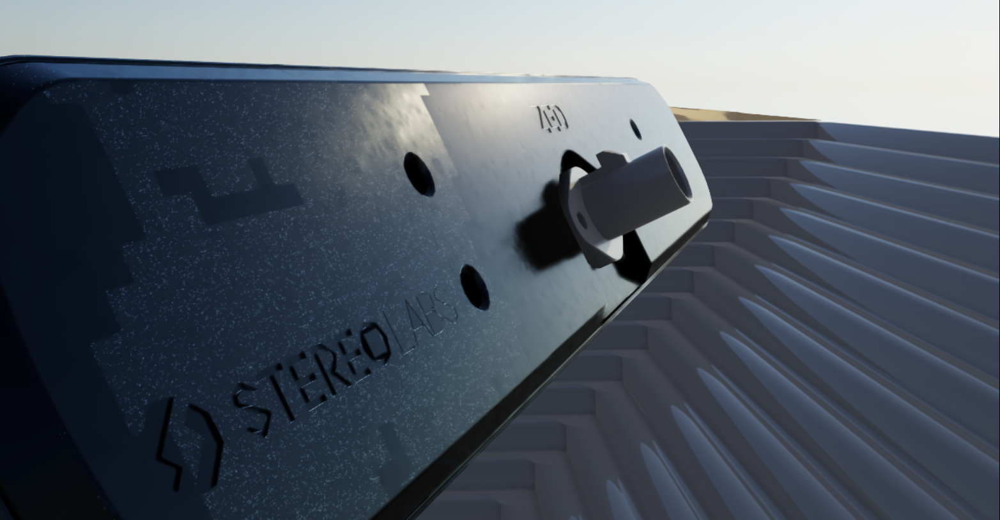
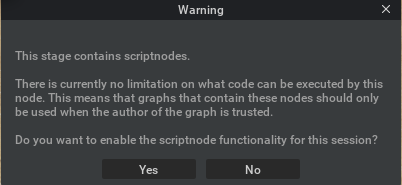
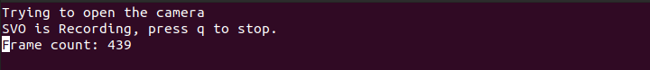
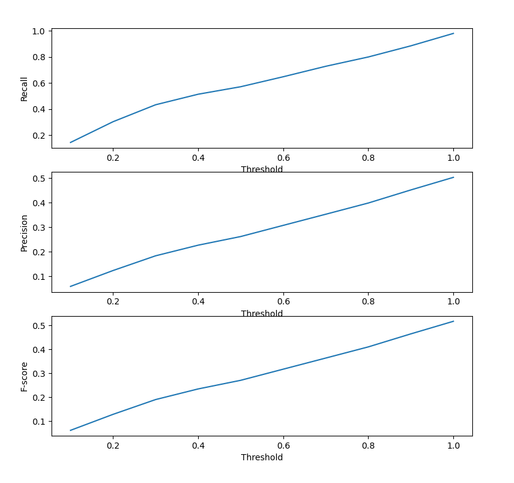

## Overview and Structure
<p align="center">
    
</p>
<p align="justify">
This repository provides the source codes that allow you to record svo inside Isaac Sim simulated environments such that your computer vision algorithms can be tested on and eventuallly benchmarked with other SOTA public algorithms.
</p>

[//]: # (Symbols we can use for folder structure  │  ├  ─  └)
The package is organized in the following manner:

```
Isaac-sim_terrain-mapping
 │
 │ 
 ├─── README.md          
 ├─── parser.yaml
 ├─── exts/
 │
 ├─── isaac_dataset_generation/
 │     ├─── background/
 │     │─── configs/
 │     │─── controller/
 │     │─── utils/
 │     │─── zed-isaac-sim/
 │     └─── TerrainMeshRecorder.py
 │   
 │   
 ├─── mesh_evaluation/
 │     ├─── sequences/
 │     │           │─── isaac_sequence_2023-04-18_17:38_pyramid_staired_terrains/
 │     │           └─── .../
 │     │             
 │     │ 
 │     └── spatial_mapping_algo/
 │                      │───sdk.4.0/
 │                      │─── simplerecon/
 │                      └── .../
 │
 │     
 │     
 └── record_svo_isaac.sh


```

<p align="center">
    
    
</p>


### isaac_dataset_generation


The environments, terrains topology and textures, can be defined by the user through a yaml file. A ZED X camera is launched alongside the terrains and can be controlled by the user via keyboard commands.
Once the simulation starts, the user is required to accept enabling the scriptnode functionalities present inside the USD stage.
<p align="center">
    
</p>

The user can move the camera through the environment with keyboard commands while recording the scene. 
<p align="center">
    
</p>


Once the user terminates the simulation, the svo, camera positional tracking, and a GT of the terrain mesh are saved in a timestamp data folder that is placed inside `mesh_evaluation/sequences/`.
The user can save the svo recording by pressing `q` in the other terminal in which the `svo_recording.py` file is running.
<p align="center">
    
</p>

The timestamp data folder (containing svo, tracking, gt mesh) is moved inside `/mesh_evaluation/sequences/` and is ready to be processed by the computer vision algorithms.


### mesh_evaluation


Spatial mapping algorithms can be tested on previously recorded svo. For instance the ZED SDK spatial mapping feature can tested by running the following command: `python3 mesh_evaluation/spatial_mapping_algo/sdk.4.0/mesheval.py`.
The running spatial mapping algorithm is displayed below:
<p align="center">
    
</p>


The spatial mapping returns an estimated mesh that is then compared with the GT mesh of the corresponding svo. The metrics being used to evaluate the performance of an algorithm are the recall, the precision and the f-score. 

<p align="center">
    
</p>


## Prequisites

In order to be able to run the source codes that compose this repository, you need to have the following installed on your machine:

* ubuntu 20.04.5
* <a href="https://docs.omniverse.nvidia.com/app_isaacsim/app_isaacsim/install_workstation.html"> Isaac Sim 2022.2.1 </a>
* ZED SDK 4.0
* more than 16Gb of RAM


If you want a smooth experience using Isaac Sim, I recommend to follow this <a href="https://docs.omniverse.nvidia.com/app_isaacsim/app_isaacsim/requirements.html#driver-requirements"> link </a> and see if your machine possesses the minimum requirements.

## First Start

1. Install the zed python API on the isaac python env:
    
   `cd ~/.local/share/ov/pkg/isaac_sim-2022.2.1/ && ./python.sh /user/local/zed/get_python_api.py`

2. add an extension inside the python path
   
   `cd ~/.local/share/ov/pkg/isaac_sim-2022.2.1/`

   open `setup_python_env.sh` and add `:$SCRIPT_DIR/extscache/omni.kit.asset_converter-1.3.4+lx64.r.cp37` inside `export PYTHONPATH`
   
3. setup the [`parser.yaml`](parser.yaml) file

4. setup the [`config.yaml`](/isaac_dataset_generation/configs/config.yaml) file

5. launch the application to record svo 
   
    `cd path/to/Isaac-sim_terrain-mapping/ && ./record_svo_isaac.sh`

6. Move the camera inside the environment via keyboard commands.
   
7. Press `space` to stop the simulation. 
   
8. Press `q` on the terminal on which the `record_svo.py` is running to save the svo. Wait until the window closes.
   
9. You can now close the isaac sim window.
   
10.  start the spatial mapping on the recorded svo:
    `cd mesh_evaluation/ && ./spatial_mapping_eval.sh`


